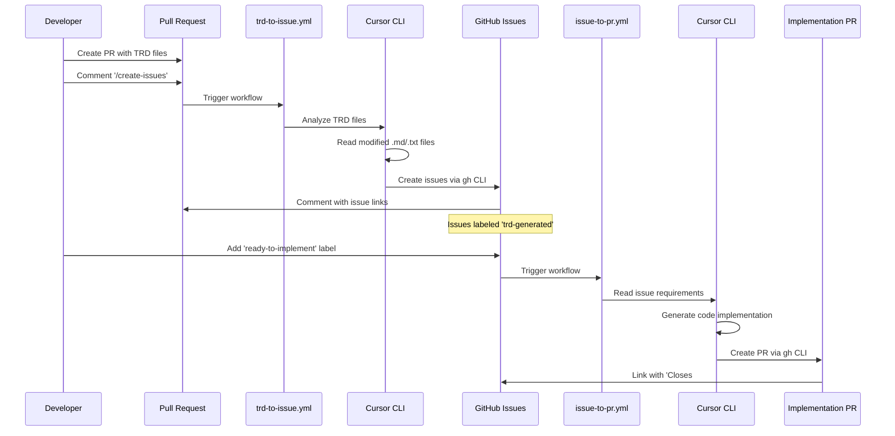

# TRD-to-GitHub-Issues Automation with Cursor CLI

This repository demonstrates how to use **Cursor CLI** in GitHub Actions to automate the conversion of Technical Requirements Documents (TRDs) into actionable GitHub issues and generate implementation code automatically.

## Overview

The system provides two main automation flows:

1. **TRD → Issues**: Cursor CLI analyzes TRD documents and creates structured GitHub issues
2. **Issue → PR**: Cursor CLI reads issue requirements and generates working code implementation

## Workflow Architecture

## Components

### Workflows

- **`.github/workflows/trd-to-issue.yml`**: Triggered by `/create-issues` comment on PRs containing TRD files
- **`.github/workflows/issue-to-pr.yml`**: Triggered when issues are labeled `ready-to-implement`

### Configuration

- **`.github/labels.yml`**: Predefined labels for workflow automation
- **`.github/ISSUE_TEMPLATE/`**: Templates for consistent issue formatting

### Key Features

- **Cursor CLI Intelligence**: Uses `cursor-agent --model sonnet-4` for advanced document analysis and code generation
- **Smart TRD Detection**: Only processes `.md` and `.txt` files that changed in the PR
- **Comprehensive Analysis**: Cursor CLI creates issues for ALL requirements, not just samples
- **Full Shell Access**: Cursor CLI runs with `-f` flag for unrestricted command execution
- **AI-Powered Implementation**: Cursor CLI generates actual working code based on issue requirements
- **Proper Linking**: Issues and PRs are automatically linked with closing references

## Usage

1. **Create TRD**: Add/modify technical requirements documents in your PR
2. **Trigger Cursor Analysis**: Comment `/create-issues` on the PR
3. **Review AI-Generated Issues**: Cursor CLI creates detailed issues for each requirement
4. **Start AI Implementation**: Add `ready-to-implement` label to desired issues
5. **Get AI-Generated Code**: Cursor CLI automatically creates implementation PR with working code

## Cursor CLI Integration

The automation leverages Cursor CLI's powerful AI capabilities:

- **Document Analysis**: `cursor-agent` reads and understands TRD content contextually
- **Issue Generation**: Creates comprehensive GitHub issues with proper formatting
- **Code Implementation**: Generates actual working code files based on requirements
- **Full Autonomy**: Runs with `-f` flag allowing complete shell command access
- **Model Selection**: Uses `--model sonnet-4` for advanced reasoning capabilities

## Requirements

- `CURSOR_API_KEY` secret configured in repository
- GitHub token permissions: `contents: write`, `pull-requests: write`, `issues: write`