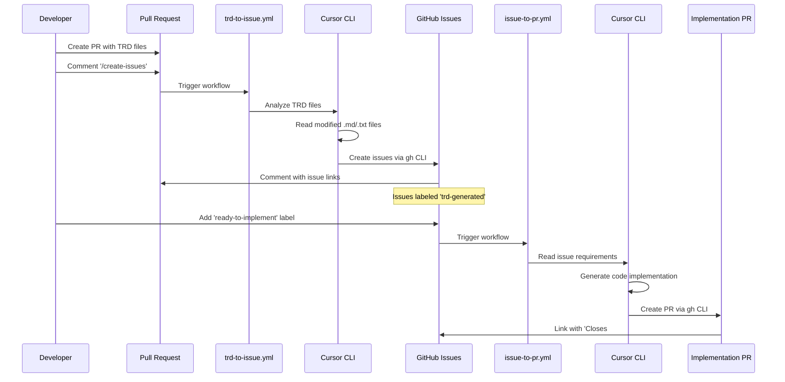

# TRD-to-GitHub-Issues Automation Demo

This repository demonstrates an automated GitHub Actions workflow that converts Technical Requirements Documents (TRDs) into actionable GitHub issues and generates pull requests using Cursor CLI.

## Overview

The system provides two main automation flows:

1. **TRD → Issues**: Convert TRD documents from pull requests into GitHub issues
2. **Issue → PR**: Generate pull requests when issues are labeled for implementation

## Workflow Architecture

## Components

### Workflows

- **`.github/workflows/trd-to-issue.yml`**: Triggered by `/create-issues` comment on PRs containing TRD files
- **`.github/workflows/issue-to-pr.yml`**: Triggered when issues are labeled `ready-to-implement`

### Configuration

- **`.github/labels.yml`**: Predefined labels for workflow automation
- **`.github/ISSUE_TEMPLATE/`**: Templates for consistent issue formatting

### Key Features

- **Smart TRD Detection**: Only processes `.md` and `.txt` files that changed in the PR
- **Comprehensive Analysis**: Creates issues for ALL requirements, not just samples
- **Full Automation**: Cursor CLI has full shell command access with `-f` flag
- **Proper Linking**: Issues and PRs are automatically linked with closing references

## Usage

1. **Create TRD**: Add/modify technical requirements documents in your PR
2. **Trigger Analysis**: Comment `/create-issues` on the PR
3. **Review Issues**: GitHub Action creates issues for each requirement
4. **Start Implementation**: Add `ready-to-implement` label to desired issues
5. **Get PR**: GitHub Action automatically creates implementation PR

## Requirements

- `CURSOR_API_KEY` secret configured in repository
- GitHub token permissions: `contents: write`, `pull-requests: write`, `issues: write`